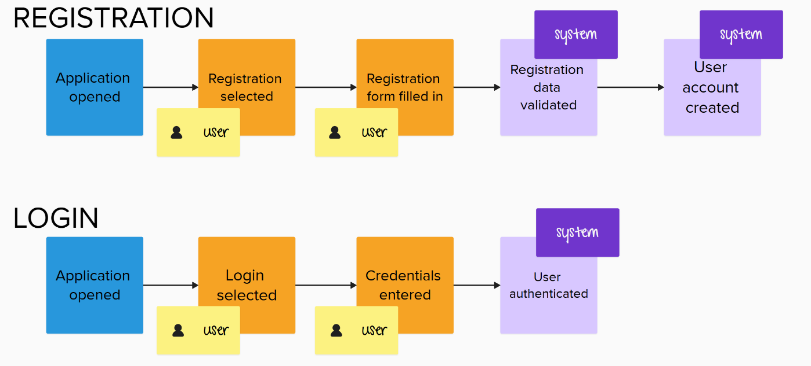
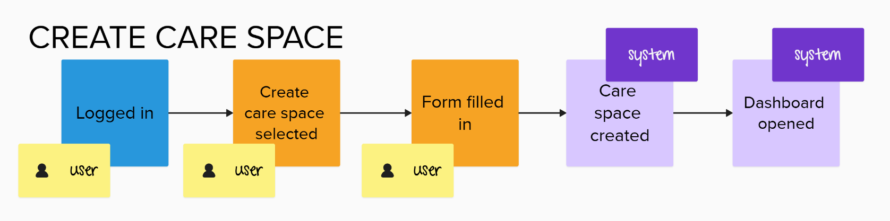
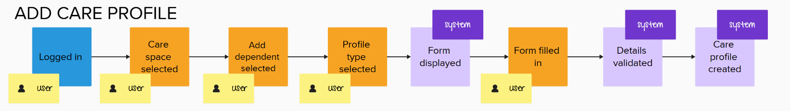
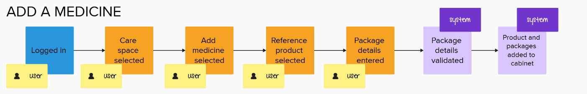
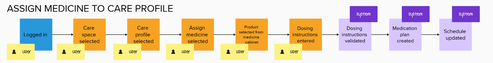

# SafeCabinet
## Main User Processes

## 1. Purpose of the Document

The purpose of this document is to describe the main user processes in the SafeCabinet application. It extends the product brief and focuses on how the user interacts with the application in everyday scenarios.

## 2. Scope

This document describes the most important processes related to:
- user registration and login,
- creating and organizing a care space,
- managing dependents,
- adding medicines to the home medicine cabinet,
- planning and recording doses,
- monitoring safety and stock levels,
- accessing public data about medicinal products.

This document does not describe implementation details or technical architecture.

## 3. Main Actors

### User
The general system user. Depending on the context, they may act as:
- a care space owner,
- a caregiver,
- a patient managing their own medicines.

### Administrator
A person managing one or more care spaces. They may act as:
- the owner of a care space,
- a caregiver,
- a user managing their own medicine cabinet.

### Dependent
A person whose medicines are stored, monitored, or administered within a given care space.

### Caregiver
A family member or another person with limited access to a selected care space.

## 4. Processes

### Process 1: Account Registration and Login

#### Goal
To allow the user to create an account and gain access to the application.

#### Process Description
1. The user opens the application.
2. The user selects the registration option.
3. The user provides basic details, such as an email address and password.
4. The system creates the user account.
5. The user may then log in to the application.
6. After successful authentication, the system grants access to care spaces.

#### Result
The user has an active account and can use the application.

#### Future Direction
In later iterations, the registration and login flow may be extended with:
- email verification via an activation link,
- social login using providers such as Google or Apple,
- passwordless authentication,
- optional multi-factor authentication for increased account security.

### Process 2: Creating a Care Space

#### Goal
To allow the user to create a separate context for medicines and dependents.

#### Process Description
1. The user logs in to the application.
2. The user selects the option to create a new care space.
3. The user fills in a simple form with basic details, such as:
    - name,
    - color,
    - icon,
    - description.
4. The system creates the care space.
5. The system opens the dashboard for the newly created space.
6. The user can now manage medicines, dependents, and caregivers within that space.

#### Result
An active care space is created and its dedicated dashboard is available to the user.

#### Future Direction
In later iterations, a care space may support additional configuration options, such as:
- privacy or visibility settings,
- default time zone,
- language preferences,
- default caregivers,
- care space templates for different scenarios,
- notes or goals describing the context of the space,
- archiving or closing a care space,
- reference attachments such as documents or package photos.

### Process 3: Adding a Care Profile

#### Goal
To create a profile for a person whose medicines and schedules will be managed within a care space.

#### Preconditions
- The user is logged in.
- The user has access to the selected care space.

#### Process Description
1. The user opens a care space.
2. The user selects the option to add a care profile.
3. The user chooses whether to add another person or themselves.
4. The system displays a form appropriate to the selected option.

##### Adding another person
5. The user enters a display name, for example - "Grandma Bozena".
6. The user may enter the person's date of birth or specifies allergy information, if known.

##### Adding the user
5. The system creates a profile for the user within the selected care space.
6. The user may enter their date of birth and specify allergy information, if known.

##### Main process
7. The system validates the submitted information.
8. The system creates the care profile and associates it with the selected care space.

Allergy information is user-provided and informational. It is not independently verified by the application and does not constitute medical advice.

#### Result
The care profile is available in the selected care space and can be associated with medicines and schedules.

#### Future Direction
Later iterations may support:
- a profile photo or avatar,
- additional profile details where needed,
- a searchable allergy reference list.

The allergy list and its data source require further investigation. Users should be able to indicate that allergy information is unknown or has not been provided; these states must not be treated as "no known allergies".

### Process 4: Adding a Medicine to a Care Space

#### Goal
To add a medicinal product and one or more physical packages to the medicine cabinet of a selected care space.

#### Preconditions
- The user is logged in.
- The user has access to the selected care space.

#### Process Description
1. The user opens a care space and selects the option to add a medicine.
2. The user searches for a medicinal product in the product catalog based on publicly available registry data.
3. The system displays matching reference products and the available product information.
4. The user selects the correct reference product.
5. The system displays the product details and available package presentations, if provided by the registry.
6. The user selects a package presentation, if available.
7. The user enters details for one or more physical packages, such as:
    - current quantity,
    - expiry date,
    - batch number, if known,
    - storage location, if relevant.
8. The user submits the details.
9. The system validates the submitted information.
10. The system links the reference product to the selected care space, if it is not already linked.
11. The system adds the physical package or packages to the care space's medicine cabinet.

#### Result
The selected reference product is available in the care space, and its physical packages are recorded as cabinet stock. Each package is tracked separately so that its quantity and expiry date can be monitored independently.

#### Future Direction
In later iterations, the user may be able to scan an GTIN or QR code on the package to identify the product and prefill available package information. The user will review and confirm the information before it is saved. Scanning may not provide all the details required to register a package, so manual entry may still be needed.

### Process 5: Assigning a Medicine to a Care Profile

#### Goal
To assign a medicinal product from the selected care space's medicine cabinet to a care profile and create a basic dosing schedule.

#### Preconditions
- The user is logged in and has access to the care space.
- The care space contains at least one medicinal product.
- A care profile exists in the selected care space.

#### Process Description
1. The user opens a care space and selects a care profile.
2. The user selects the option to add a medicine.
3. The user selects a medicinal product from the care space's medicine cabinet.
4. The user enters the dosing instructions:
    - quantity per dose,
    - frequency or interval,
    - administration times, if applicable.
5. The user submits the dosing instructions.
6. The system validates the information and creates a medication plan for the selected care profile.
7. The system displays the planned doses in the care profile's schedule.

The medication plan is associated with the medicinal product, not with a specific physical package. Creating a plan does not reduce the cabinet stock.

#### Result
The medicinal product has an active basic dosing plan for the selected care profile, and its planned doses are visible in the schedule.

#### Future Direction
Later iterations may support more complex dosing patterns, such as treatment periods followed by breaks, repeated cycles or user-entered conditional instructions. The application will record the instructions provided by the user, but it will not recommend or calculate treatment changes.